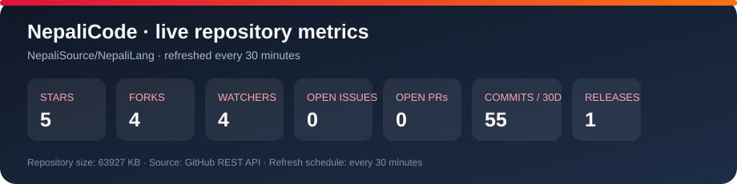

# NepaliCode 🇳🇵

<p align="center">
  <a href="https://github.com/NepaliSource/NepaliLang/stargazers">
    
  </a>
  <a href="https://github.com/NepaliSource/NepaliLang/forks">
    
  </a>
  <a href="https://github.com/NepaliSource/NepaliLang/issues">
    
  </a>
  <a href="https://github.com/NepaliSource/NepaliLang/blob/main/LICENSE">
    
  </a>
  <a href="https://github.com/NepaliSource/NepaliLang/releases">
    
  </a>
  <a href="https://nepalisource.github.io/NepaliLang/">
    
  </a>
</p>

<p align="center">
  
  
  
  
  
</p>

<p align="center">
  
  
  
  
  
</p>

<p align="center">
  
  
  
  
</p>

<p align="center">
  <a href="https://github.com/NepaliSource/NepaliLang"></a>
</p>

<p align="center">
  <a href="https://github.com/NepaliSource/NepaliLang/actions/workflows/update-metrics.yml"></a>
</p>

## 🎬 Visual Showcase

<p align="center">
  <a href="https://nepalisource.github.io/NepaliLang/showcase.html">
    
  </a>
</p>

<p align="center">
  <a href="https://nepalisource.github.io/NepaliLang/showcase.html">
    
  </a>
  <a href="showcase/README.md">
    
  </a>
  <a href="https://github.com/NepaliSource/NepaliLang/archive/refs/heads/main.zip">
    
  </a>
</p>

> **NepaliCode** is a modern programming language from Nepal with native keywords, Unicode support, and a bytecode VM. [Explore the docs](docs/) or [watch the demo](https://nepalisource.github.io/NepaliLang/showcase.html).

<p align="center">
  
  
</p>

---

## 🌟 A Modern, Simple Programming Language from Nepal

<p align="center">
  <i>"Programming should be simple enough that a Nepali beginner can understand what the code is doing."</i>
</p>

<p align="center">
  
  
</p>

**NepaliCode** is designed to be simple, expressive, and accessible while being powerful enough for real projects. It brings the beauty of Nepali language to programming with native keywords and full Unicode support.

---

## 🚀 Quick Start

### 📥 Download Installer

<p align="center">
  <a href="https://github.com/NepaliSource/NepaliLang/releases">
    
  </a>
  <a href="https://github.com/NepaliSource/NepaliLang/releases">
    
  </a>
</p>

### ⚡ Installation

**Option 1: All-in-One Installer (Recommended)**
```bash
# Download NepaliCode_Setup.exe from releases
# Run the installer
# Select options: PATH, VS Code extension, shortcuts
# Ready to use!
```

**Option 2: Using Python (Development)**
```bash
git clone https://github.com/NepaliSource/NepaliLang.git
cd NepaliLang
python main.py examples/01_hello_world.np
```

**Option 3: VS Code Extension**
```bash
# Install from VS Code Marketplace
# Search "NepaliCode" and install
```

---

## ✨ Features

### 🎯 Language Features

<p align="center">
  
  
  
  
</p>

- ✅ **Python-like syntax** - Familiar and intuitive
- ✅ **Nepali keywords** - `yedi` (if), `kaam` (def), `firta` (return)
- ✅ **Full Unicode support** - Nepali text and identifiers
- ✅ **Bytecode VM** - Stack-based virtual machine
- ✅ **Module system** - Professional Python-like imports
- ✅ **OOP support** - Classes, inheritance, methods
- ✅ **Error handling** - Try/except with Nepali keywords
- ✅ **Async foundation** - async/await patterns

### 📚 Standard Library

<p align="center">
  
  
</p>

- 🧮 **ganit** - Mathematics operations
- ⏰ **samaya** - Date and time functions
- 🎲 **randomlib** - Random number generation
- 📄 **jsonlib** - JSON parsing and stringifying
- 📁 **file** - File operations
- 🗄️ **database** - SQLite database support
- 🌐 **anurodh** - HTTP requests (requests-like API)
- ⚡ **asyn** - Async programming foundation
- 🤖 **telegram** - Telegram bot foundation
- 🌍 **browser** - Browser automation foundation

### 🛠️ Developer Tools

<p align="center">
  
  
  
  
</p>

- 💻 **CLI** - Command-line interface with full options
- 🔧 **REPL** - Interactive shell for testing
- 🎨 **VS Code Extension** - Syntax highlighting, run/debug
- 📖 **50+ Examples** - Comprehensive learning resources
- 📝 **Bytecode compiler** - Compile .np to bytecode
- 🏗️ **Interpreter** - Fallback for complex features

---

## 📖 Syntax Examples

### Variables and Types
```np
name = "Diwas"
age = 21
is_student = sacho
items = [1, 2, 3, 4, 5]
user = {"name": "Diwas", "age": 21}
```

### Conditions (Nepali Keywords)
```np
yedi age >= 18:
    print("Adult")
athawa age >= 13:
    print("Teen")
natra:
    print("Child")
```

### Loops
```np
ko_lagi item ma items:
    print(item)

jabasamma count < 10:
    count += 1
```

### Functions
```np
kaam add(a, b):
    firta a + b

kaam greet(name="World"):
    print(f"Namaste {name}!")
```

### Classes
```np
kakshya Person:
    kaam __init__(self, name, age):
        self.name = name
        self.age = age
    
    kaam greet(self):
        firta f"Namaste, I am {self.name}"
```

### Modules
```np
lyau ganit
lyau jsonlib
lyau file

print(ganit.jod(5, 3))
data = jsonlib.parse('{"name": "Diwas"}')
content = file.read("file.txt")
```

---

## 🇳🇵 Nepali Keywords Reference

| English | Nepali | Meaning |
|---------|--------|---------|
| def | kaam | function |
| return | firta | return |
| if | yedi | if |
| else | natra | else |
| elif | athawa | elif |
| for | ko_lagi | for |
| while | jabasamma | while |
| in | ma | in |
| class | kakshya | class |
| import | lyau | import |
| from | bata | from |
| try | koshish | try |
| except | samau | except |
| finally | antya | finally |
| raise | uthau | raise |
| with | bhitra | with |
| and | ra | and |
| or | wa | or |
| not | hoina | not |
| True | sacho | true |
| False | jhut | false |
| None | khali | none |
| break | rok | break |
| continue | agadi | continue |

---

## 📁 Project Structure

```
NepaliCode/
├── src/                    # Core language implementation
│   ├── lexer.py           # Lexical analysis
│   ├── parser.py          # Parsing and AST
│   ├── interpreter.py     # Interpreter
│   ├── bytecode.py        # Bytecode VM
│   └── cli.py             # Command-line interface
├── stdlib/                # Standard library modules
│   ├── ganit.py          # Mathematics
│   ├── samaya.py         # Date/time
│   ├── randomlib.py      # Random
│   ├── jsonlib.py        # JSON
│   ├── file.py           # File operations
│   ├── database.py       # SQLite
│   ├── anurodh.py        # HTTP
│   └── ...
├── examples/              # 50+ example programs
│   ├── 01_hello_world.np
│   ├── 02_variables_and_types.np
│   └── ...
├── tests/                 # Test suite
├── vscode-extension/      # VS Code extension
├── dist/                  # Build artifacts
│   ├── NepaliCode_Setup.exe
│   └── nepali.exe
├── docs/                  # Documentation
│   ├── index.html        # Website
│   ├── installation.html
│   ├── syntax.html
│   └── ...
└── README.md
```

---

## 🧪 Testing

```bash
# Run all tests
python tests/run_all_tests.py

# Run specific test
python tests/test_bytecode.py

# Run examples
python main.py examples/01_hello_world.np
```

---

## 📚 Documentation

- 🌐 **Website:** https://nepalisource.github.io/NepaliLang/
- 📖 **Installation Guide:** [docs/installation.html](docs/installation.html)
- 🎯 **First Program:** [docs/first_program.html](docs/first_program.html)
- 📝 **Syntax Reference:** [docs/syntax.html](docs/syntax.html)
- 📚 **Standard Library:** [docs/stdlib.html](docs/stdlib.html)
- 💡 **Examples Catalog:** [docs/examples.html](docs/examples.html)
- 🔧 **GitHub Repository:** https://github.com/NepaliSource/NepaliLang

---

## 🗺️ Roadmap

### ✅ Phase 1: Complete (Current)
- [x] Language core (lexer, parser, interpreter)
- [x] Bytecode VM
- [x] Module system
- [x] Standard library (10+ modules)
- [x] CLI and REPL
- [x] VS Code extension
- [x] 50+ examples
- [x] Documentation
- [x] Windows installer
- [x] GitHub Pages website

### 🚧 Phase 2: In Progress
- [ ] Enhanced HTTP library with full runtime support
- [ ] Improved async runtime
- [ ] Type system foundation
- [ ] Package manager foundation

### 🔮 Phase 3: Future
- [ ] **Android APK** - Mobile version (planned, requires Android Studio)
- [ ] **macOS Installer** - Cross-platform support
- [ ] **Linux Installer** - Cross-platform support
- [ ] Native runtime (no Python dependency)
- [ ] Full LSP implementation
- [ ] Package manager (nppm)
- [ ] Advanced compiler optimizations
- [ ] Cloud tools and integrations

---

## 🤝 Contributing

Contributions are welcome! Please read [CONTRIBUTING.md](CONTRIBUTING.md) for guidelines.

### Development Workflow
1. Fork the repository
2. Create a feature branch
3. Make your changes
4. Add tests
5. Submit a pull request

---

## 👥 Author

<p align="center">
  
  
</p>

**Diwas Khatri**
- 👤 GitHub: [DiwasKhatri07](https://github.com/DiwasKhatri07)
- 📧 Email: diwaskhatri@proton.me
- 🏢 Organization: [NepaliSource](https://github.com/NepaliSource)
- 🌐 Website: https://nepalcode.com
- 📍 Location: Nepal

### Credits
- 💡 Inspired by Python's simplicity and elegance
- 🇳🇵 Built with love for the Nepali programming community
- 🙏 Thanks to all contributors and supporters

---

## 📄 License

<p align="center">
  
</p>

This project is licensed under the MIT License - see the [LICENSE](LICENSE) file for details.

---

## 🌐 Links

<p align="center">
  <a href="https://github.com/NepaliSource/NepaliLang">
    
  </a>
  <a href="https://nepalisource.github.io/NepaliLang/">
    
  </a>
  <a href="https://github.com/NepaliSource/NepaliLang/issues">
    
  </a>
  <a href="https://github.com/NepaliSource/NepaliLang/discussions">
    
  </a>
</p>

- **GitHub Repository:** https://github.com/NepaliSource/NepaliLang
- **Documentation:** https://nepalisource.github.io/NepaliLang/
- **Releases:** https://github.com/NepaliSource/NepaliLang/releases
- **Issues:** https://github.com/NepaliSource/NepaliLang/issues
- **Discussions:** https://github.com/NepaliSource/NepaliLang/discussions
- **Email:** diwaskhatri@proton.me

---

## 🎯 Tags and Categories

<p align="center">
  
  
  
  
  
  
  
</p>

**Categories:**
- 🖥️ Programming Language
- 🇳🇵 Nepali Language
- 👨‍💻 Beginner-Friendly
- 📚 Educational
- 🔤 Unicode Support
- ⚡ Bytecode VM
- 🐍 Python-like

---

## 🔧 Developer Experience

<p align="center">
  
  
  
  
</p>

- **VS Code Extension:** Syntax highlighting, snippets, file icons, run/debug integration
- **REPL:** Interactive shell for testing code
- **CLI:** Full command-line interface with options
- **Debugger:** Integrated debugging support
- **Formatter:** Code formatting (planned)
- **LSP:** Language Server Protocol (planned)

---

## 🎨 Design Philosophy

<p align="center">
  
  
  
  
</p>

**Principles:**
- 🎯 **Simple** - Easy to learn and write
- 💡 **Expressive** - Clean, natural syntax
- 🇳🇵 **Nepali** - Native Nepali identity
- 🔧 **Professional** - Production-ready features
- 👨‍👩 **Beginner-Friendly** - Accessible to everyone
- 🌍 **Community** - Open and welcoming

---

## 📈 Performance

<p align="center">
  
  
  
</p>

- ⚡ **Bytecode compilation** - Faster execution
- 🔄 **Interpreter fallback** - Complex features supported
- 🎯 **Optimized performance** - Efficient execution model
- 💾 **Memory management** - Automatic garbage collection

---

## 🔐 Security

<p align="center">
  
  
  
</p>

- 🔒 **MIT License** - Permissive open source license
- 📜 **Open Code** - All code is visible and auditable
- 🔐 **No secrets** - No hardcoded credentials
- ✅ **Safe by default** - Secure default configurations

---

## 🌍 Community

<p align="center">
  
  
  
</p>

- 💬 **Discussions:** Join the conversation
- 🐛 **Issues:** Report bugs and request features
- 📝 **Pull Requests:** Contribute code
- 🌟 **Stars:** Show your support
- 🍴 **Forks:** Create your own version

---

## 🎓 Learning Resources

<p align="center">
  
  
  
</p>

- 📖 **50+ Examples** - From basics to advanced topics
- 📚 **Complete Documentation** - Installation, syntax, stdlib
- 🎯 **Learning Path** - Structured learning resources
- 💡 **Quick Start** - Get started in minutes
- 🔧 **Practical Examples** - Real-world use cases

---

## 🏆 Achievements

<p align="center">
  
  
  
  
  
</p>

- ✅ **50+ comprehensive examples** covering all features
- ✅ **10+ standard library modules** for common tasks
- ✅ **Bytecode VM** for efficient execution
- ✅ **GitHub Pages website** with full documentation
- ✅ **VS Code extension** with syntax highlighting
- ✅ **Professional installer** (like Python setup.exe)
- ✅ **MIT License** - Open source and permissive
- ✅ **Complete documentation** - Installation, syntax, stdlib

---

## 📊 Statistics

<p align="center">
  
  
  
  
</p>

- 📝 **Lines of Code:** 18,000+
- 📁 **Files:** 135
- 📚 **Examples:** 50+
- 📦 **Modules:** 10+
- 🎯 **Language Features:** 20+

---

## 🎯 Use Cases

<p align="center">
  
  
  
  
</p>

- 🎓 **Education** - Teaching programming in Nepal
- 📜 **Scripting** - Automation and task automation
- 🤖 **Automation** - Desktop and web automation
- 👨‍🏫 **Teaching** - Programming education
- 🌐 **Web Development** - Web applications
- 📱 **Mobile Development** - Mobile apps (future)
- 🎮 **Game Development** - Game development (future)

---

## 🌟 Special Features

<p align="center">
  
  
  
  
</p>

- 🇳🇵 **Nepali Keywords** - Native language support
- 🔤 **Unicode Identifiers** - Nepali variable names
- ⚡ **Bytecode VM** - Stack-based virtual machine
- 🎨 **VS Code Integration** - Professional IDE support
- 📦 **All-in-One Installer** - Easy setup like Python
- 🌐 **GitHub Pages** - Professional documentation website

---

## 🔄 Version History

<p align="center">
  
  
  
</p>

### v0.1.0-alpha (Current)
- ✅ Initial release
- ✅ Complete language implementation
- ✅ Bytecode VM
- ✅ Standard library
- ✅ 50+ examples
- ✅ VS Code extension
- ✅ Windows installer
- ✅ GitHub Pages website

---

## 📦 Downloads

<p align="center">
  <a href="https://github.com/NepaliSource/NepaliLang/releases">
    
  </a>
  
</p>

### Latest Release: v0.1.0-alpha

**Windows Installer:**
- 📦 `NepaliCode_Setup.exe` (13.6 MB) - All-in-one installer
- ⚡ `nepali.exe` (9.0 MB) - Standalone runtime

**Source Code:**
- 📦 Clone repository: `git clone https://github.com/NepaliSource/NepaliLang.git`

---

## 🎉 Getting Started

### 🥇 First Program

Create `hello.np`:
```np
print("Namaste Nepal!")
```

Run it:
```bash
nepali.exe hello.np
```

### 📚 Learn More

- 📖 **Installation Guide:** [docs/installation.html](docs/installation.html)
- 🎯 **First Program:** [docs/first_program.html](docs/first_program.html)
- 📝 **Syntax Reference:** [docs/syntax.html](docs/syntax.html)
- 📚 **Standard Library:** [docs/stdlib.html](docs/stdlib.html)
- 💡 **Examples:** [docs/examples.html](docs/examples.html)

---

## 🙏 Acknowledgments

<p align="center">
  
  
</p>

- 💡 Inspired by Python's simplicity and elegance
- 🐍 Built with love for the Nepali programming community
- 🙏 Thanks to all contributors and supporters
- 🌟 Thanks to the open source community

---

## 📞 Support

<p align="center">
  <a href="https://github.com/NepaliSource/NepaliLang/issues">
    
  </a>
  <a href="https://github.com/NepaliSource/NepaliLang/discussions">
    
  </a>
  
</p>

- 🐛 **Issues:** https://github.com/NepaliSource/NepaliLang/issues
- 💬 **Discussions:** https://github.com/NepaliSource/NepaliLang/discussions
- 📧 **Email:** diwaskhatri@proton.me

---

<p align="center">
  
  
</p>

---

**Made with ❤️ in Nepal** 🇳🇵

*NepaliCode - Programming from Nepal, for the World*
